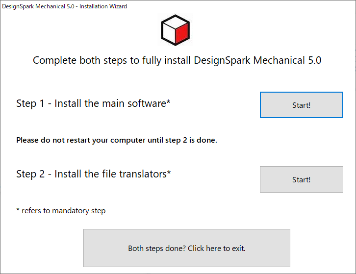

# 猫でも分かるDesignSpark Mechanicalの使い方

## はじめに
この記事は高知工科大学 
[Advent Calendar 2020](https://adventar.org/calendars/5887) 
20日目の記事です。

会社で何故かCADをやることになり最低限の操作を覚えたので、
ラズパイの箱を作るチューとリアルで使い方を共有します。

## 環境

[DesignSpark Mechanical](https://www.rs-online.com/designspark/mechanical-software-jp)
の公式からDLしてインストールします。

Step1,2の順でインストール

ソフトを立ち上げて、アカウント登録したら環境の完成です。
ここまでつまずきポイントはないと思います。

## Raspberry Piの箱の作り方

### 1.Raspberry PiのSTLデータの用意
DesignSpark MechanicalはRSが提供しているCADツールなので 
RSで扱っている商品の大半のCADデータを簡単にインポートすることが出来ます。

### 2.移動方法

### 3.
### 4.
### 5.
### 6.
### 7

## おわりに

CADが使えるようになったら次は3Dプリンタを買いましょう！僕お金がないのでサンタさんにお願いします。