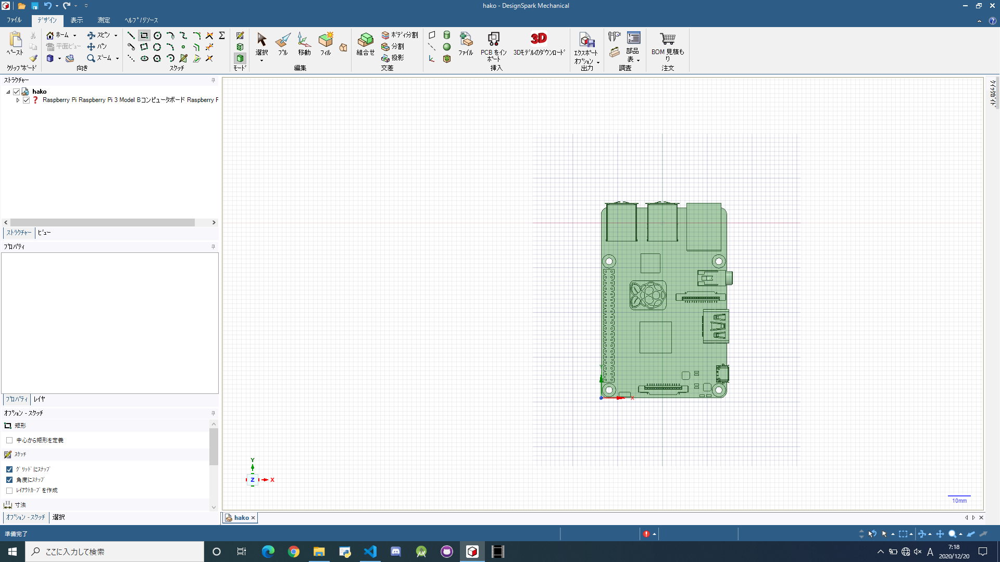

# 猫でも分かるDesignSpark Mechanicalの使い方

## はじめに

この記事は高知工科大学 
[Advent Calendar 2020](https://adventar.org/calendars/5887) 
20日目の記事です。既に学生ではありません。

会社で何故かCADをやることになり最低限の操作を覚えたので、
Raspberry Piの箱を作るチューとリアルで使い方を共有します。

## 環境

[DesignSpark Mechanical](https://www.rs-online.com/designspark/mechanical-software-jp)
の公式からDLしてインストールします。

Step1,2の順でインストール

ソフトを立ち上げて、アカウント登録したら環境の完成です。
ここまでつまずきポイントはないと思います。

## Raspberry Piの箱の作り方

### 1.Raspberry Piの3Dデータの用意
DesignSpark MechanicalはRSが提供しているCADツールなので 
RSで扱っている商品の大半のCADデータを簡単にインポートすることが出来ます。
 

### 2.移動方法

移動について公式が書いているがあるので
[Link](https://designspark.zendesk.com/hc/ja/articles/214147205-DesignSpark-Mechanical-%E5%9F%BA%E6%9C%AC%E6%93%8D%E4%BD%9C%E5%85%A5%E9%96%80%E7%B7%A8)
を貼っておきます(楽ちん！) 
スピンとパンとズームがあれば最低限移動出来ると思います。

- スピン 操作：ホイールドラッグ
- パン　操作：Shitf + ホイールドラッグ
- ズーム 操作：ホイールスクロール or Ctrl + ホイールドラッグ 

ここでPCがCAD設計に適しているか確認します。
ホイールをドラッグしてぐるぐるマウスを動かします。  

カクカクせずに動作すればCADに適したPCと言えます。 
ちなみに何か見覚えはありませんか？ 
         
そうこれです。    

この確認方法はButter-Fly Checkと呼ばれており、グローバルスタンダードです。
    
はい、嘘です。

### 3.直方体作成
直方体の作成について、この操作が出来ればCADの操作の5割覚えたといっても過言ではありません。 
Let's 5割！
  
まずはRaspberry Piを真上に見ます。
 

 
長方形を適当に引きます。ここで理想サイズに合わせても良いし、後からでも調整出来ます。今回はRaspberry Piの3Dがあるので後から調整します。
 

 
適当な高さに押し出しプルします。
 

 
はい！Raspberry Piの箱が完成しました！！お疲れ様でした。...........は？

### 4.プルの別の使い方
### 5.
### 6.面取り
このままでは角が鋭くお子さんがRaspbrry Piを使って遊ぶ際に危険なので角を面取りします。

### 7

## おわりに

CADが使えるようになったら次は3Dプリンタを買いましょう！僕お金がないのでサンタさんにお願いします。