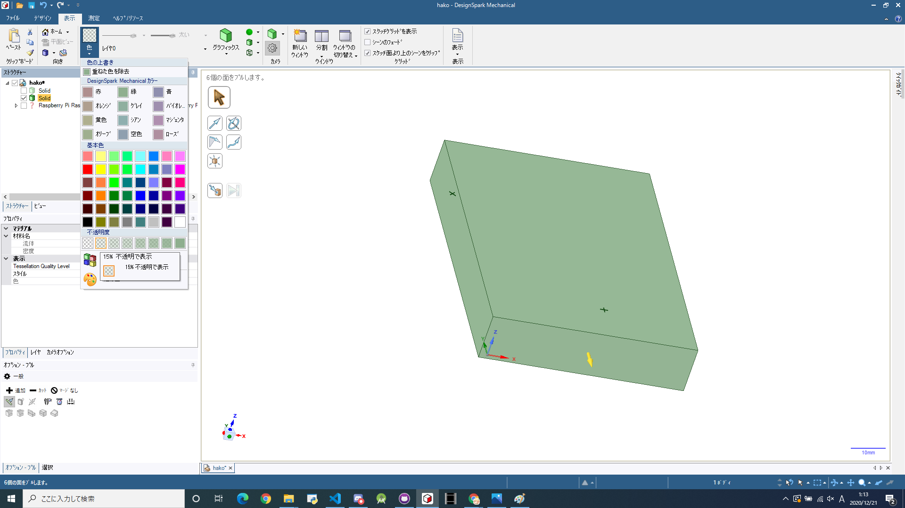
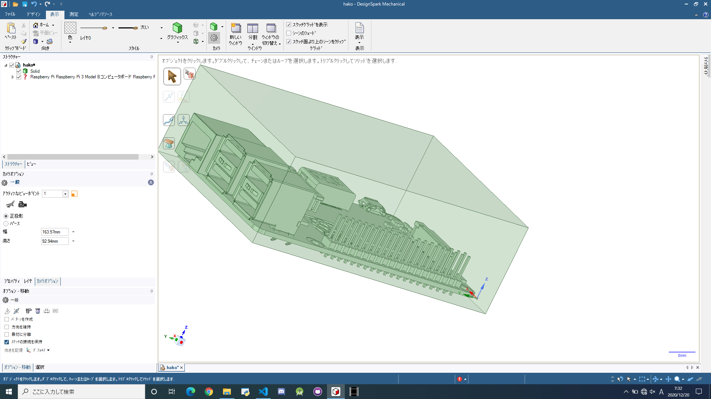

# 猫でも分かるDesignSpark Mechanicalの使い方

## はじめに

この記事は高知工科大学 
[Advent Calendar 2020](https://adventar.org/calendars/5887) 
20日目の記事です。既に学生ではありません。
 
会社で何故かCADをやることになり最低限の操作を覚えたので、Raspberry Piの箱を作るチューとリアルで使い方を共有します。 

## 環境

[DesignSpark Mechanical](https://www.rs-online.com/designspark/mechanical-software-jp)
の公式からDLしてインストールします。

Step1,2の順でインストール

ソフトを立ち上げて、アカウント登録したら環境の完成です。
ここまでつまずきポイントはないと思います。

## Raspberry Piの箱の作り方

### 1.Raspberry Piの3Dデータの用意
DesignSpark MechanicalはRSが提供しているCADツールなので 
RSで扱っている商品の大半のCADデータを簡単にインポートすることが出来ます。
  

 
ツールバーの3Dモデルのダウンロード、検索で**Raspberry Pi 3**と検索すると3Dモデルがヒットするのでクリックします。
  

 
DesignSpark MechanicalでDLします。
  

 
モデルの追加は、プロジェクトのデザインに **.rsdoc**ファイルをドロップすると追加出来ます。 
**デザインがない場合は、左上のファイルから新規作成で出来ます。**

 

### 2.移動方法

#### **視点移動編**

移動について公式が書いているがあるので
[Link](https://designspark.zendesk.com/hc/ja/articles/214147205-DesignSpark-Mechanical-%E5%9F%BA%E6%9C%AC%E6%93%8D%E4%BD%9C%E5%85%A5%E9%96%80%E7%B7%A8)
を貼っておきます(楽ちん！) 
スピンとパンとズームがあれば最低限移動出来ると思います。

- スピン 操作：ホイールドラッグ
- パン　操作：Shitf + ホイールドラッグ
- ズーム 操作：ホイールスクロール or Ctrl + ホイールドラッグ 

ここでPCがCAD設計に適しているか確認します。
ホイールをドラッグしてぐるぐるマウスを動かします。  

カクカクせずに動作すればCADに適したPCと言えます。 
ちなみに何か見覚えはありませんか？ 
         
そう！これです。    

この確認方法はButter-Fly Checkと呼ばれており、グローバルスタンダードです。
    
はい、嘘です。 
向きがおかしくなったら、ツールバーのデザイン、ホームでデフォルトの位置に戻ると思います。
  

#### **物体移動編**
 

単純にものを移動させたい場合は、移動させたいデザインのオブジェクトをクリックして ツールバーの移動を選択して青,赤,緑の矢印を引っ張れば全体的に移動すると思います。
  

 
この移動矢印は好きな面に置くことが出来るので裏面を起点にしたかったら黄色の丸をドラッグして裏面に持っていきます。
  

### 3.直方体作成
直方体の作成について、この操作が出来ればCADの操作の5割覚えたといっても過言ではありません。
  

 
まずはRaspberry Piを真上に見ます。 
左下のXYZキューブでクリックしたり、ドラッグすると見たい位置に移動できると思います。
  

 
長方形を適当に引きます。ここで理想サイズに合わせても良いし、後からでも調整出来ます。 
今回はRaspberry Piの3Dがあるので後から調整します。
  

 
長方形が引けたら適当な高さに押し出しプルします。デザイン、編集にプルがあるので選択して 
黄色の矢印が出るので引っ張ります。
  

 
直方体が出来ても透けていないと見えずらいので透けさせたいsolidを選択してツールバーの 
表示、色、不透明度で下ると見えやすいです。
  

 
はい！Raspberry Piの箱が完成しました！！お疲れ様でした!!
 
  
  
 

...........は？
 
 
### 4.プルの別の使い方
プルは面を押し出して直方体を作る以外に任意サイズの面をへこませたり貫通させることも可能です。  

 
Raspberry Piをチェックを外して非表示にして直方体の面の上に先ほどした同じ操作で長方形を描きます。
  

 
描いたらその面に対してまたプルすることが出来るのでへこむ方向に黄色矢印を引っ張ると上が空いた箱になると思います。 
この状態で長さが適当でも大丈夫です。
 

### 5.面位置の調整
この操作はDesign Spark Mechanicalの**超重要**な操作でもの長さ位置関係はこの操作で調整することになります。 
まず、これくらいの位置関係に持っていきます。
操作としては 
 ↓
ツールバーの移動を選択
 ↓
面を選択
 ↓
移動矢印クリック(赤,青,緑の移動したい矢印)
 ↓
定規をクリック
 ↓
面との距離を定義するための辺か面をクリック
 
長さを入力
 

  
でその場所まで面が移動すると思います。 
この操作でRaspbery Piの辺や面を参照することですきな長さの箱が作成可能になったはずです。 
USBポートの穴もこのそうさで長方形を面に描いてプルで押し出せば貫通出来ると思います。

そしてここまで書いて伝わらない気がしたのでUSBポートの穴開けの動画を作成したのでそれを参考に操作を覚えてください。 
（これだけでよかった説あるな.....）

Youtube:[DesignSpark Mechanicalの操作例](https://www.youtube.com/watch?v=vnWUKMdq3Dc)

これで簡単な箱は作れるようになったはずなので好きな形状の箱を作りましょう！！

### 6.面取り
最後にお子さんがRaspbrry Piを使って遊ぶ場合に、角が鋭いと危険なので面取り機能を紹介します。

 

 
プルを選択して面取りしたい辺を選択するとR指定で面取り出来ます。(プルで出来ること多すぎ...)
 
 

## おわりに
チュートリアル系書くの途中で絶対面倒くさくなるので僕には向いてませんでした。 
コメントで分からないことを書いてくれれば更新するかもしれませんのでもしあれば残してください。
  
そして、CADが使えるようになったら次は3Dプリンタを買いましょう！僕お金がないのでサンタさんにお願いします。